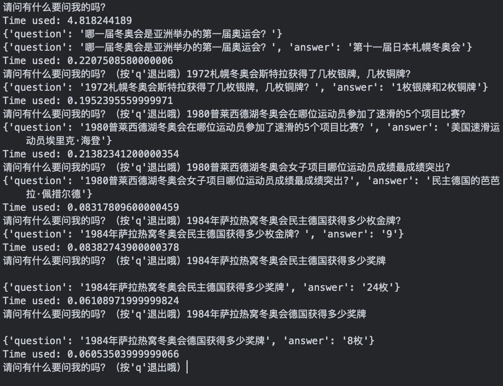

# Project Report of Winter Olympic Games Q&A Chatbots

## 1  INTRODUCTION

### 1.1  Problem Background

On July 31, 2015, Beijing successfully applied for the 2020 Olympic Games, and will jointly hold the 2020 Winter Olympic Games with Zhangjiakou City. Therefore, it is necessary to construct a question answering system which can automatically answer the questions related to the Winter Olympic Games in order to meet people's growing demand for knowledge.

### 1.2  Problem Overview

Build a question and answer system about the Winter Olympics. Its function is: when a question related to the Winter Olympics is entered, the system will give a corresponding answer.

> **Example**：
>
> - Question：哪⼀届冬奥会是亚洲举办的第⼀届奥运会？
>
> - Answer：第⼗⼀届⽇本札幌冬奥会/第⼗⼀届/11/⽇本札幌冬奥会。

### 1.3  Data Provided

1. (In total) 14701 pieces of labeled data (i.e. correctly matched Q&A pairs):
   - Each question-and- answer-pair includes the following elements: question, answer, #1 question type, #1 domain type, #1 semantic type, #2 question type, #2 domain type, #2 semantic type;
2. WinterOlympics knowledge map.

### 1.4  Project Requirements

1. Input and output information should be in json format, like this:
   - `{“answer”:”...”,”question”:”...”}` ;
2. Excluding the time to load the initial model, the time needed to make a single response should be less than 500ms.

## 2  Methods

### 2.1  Basic ideas

To design a complete dialogue system, the first thing is to preprocess the data. This includes deleting useless words, invalid question and answer pairs, punctuation and word segmentation.

The second step is to vectorize the data. Here we can choose the methods of word frequency quantization, word2vec, TF-IDF and so on. Because the word frequency vectorization only considers the word as a number, without emotional factors, we do not choose it.

We use **word2vec** and **TF-IDF** for vectorization, and then compare the vectorized test questions with each question in the training set to output the answers of the questions with the highest similarity.

> The method of **word frequency quantization** was NOT selected due to its rough processing on emotion, since this kind of models are supposed to consider the words as scalars without emotional factors.

### 2.2  Model 1 : TF-IDF

**TF-IDF** is a statistical method to evaluate the importance of a word to a file set or one of the files in a corpus. TF is the word frequency and IDF is the inverse text frequency index.

The main idea of TF-IDF: if a word or phrase appears frequently in one article and rarely in other articles, it is considered that the word or phrase has a good ability to distinguish categories and is suitable for classification.

### 2.3  Model 2 : Word2Vec

**Word2vec** model is a two-layer neural network, which uses continuous bag of words (cbow) to build neural word embedding. It transforms words into word vectors.

Word vectors have good semantic characteristics, which is a common way to express the characteristics of words. The value of each dimension of the word vector represents a feature with certain semantic and grammatical interpretation.

## 3  Solution 1: TF-IDF

### 3.1  Steps in brief

We choose the tf-idf method to represent the text as a vector, and the sum of the tf-idf of user's query keywords as a measure of similarity.

The steps are as follows:

1. Do data cleaning and return the problem set of questions and answers;
2. Split text and establish a vocabulary;
3. Establish tf-idf matrix for the problem set;
4. Calculate the keywords of the user query and find the id corresponding to the keyword;
5. According to the tf-idf matrix, return the answer with the highest score;
6. Encode the returned answer in json format.

### 3.2  Implementation

#### 3.2.1  Prepare Q&A pairs

Combine the Q & A pairs of the two labeled datasets. Segment all the questions and convert them into word vectors.

```python
def prepare_data():
    # Combine the Q & A pairs of the two labeled datasets
    data1 = pd.read_excel('data/标注数据1.xlsx', usecols=[0, 1])
    data1.columns = ['question', 'answer']
    data2 = pd.read_excel('data/标注数据2.xlsx', usecols=[0, 1])
    data2.columns = ['question', 'answer']
    data = pd.concat([data1, data2], sort=True)
    print(data.shape)
    # cut words
    questions = list(data.loc[:, 'question'])
    corpus = []
    for q in questions:
        corpus.append(' '.join(jieba.lcut(str(q))))
    # do Word-Embedding to the set of cutted questions
    vec = TfidfVectorizer(token_pattern=r"(?u)\b\w+\b", stop_words=[' 冬奥会', '冬季', '奥林匹克', '运动会'])
    tfidf = vec.fit_transform(corpus).toarray()
    print(tfidf.shape)
    words = vec.get_feature_names()
    with open('data/word.txt', 'w', encoding='utf-8') as f:
        for i in range(len(words)):
            f.write(words[i]+'\n')
    tfidf = list(tfidf)	                        # Q&A pairs' tf-idf matrix
    words = list(words)                     	# words with characters
    data = data[['question', 'answer']].values	# processed Q&A pairs
    return tfidf, words, data
```

The `TfidfVectorizer()` function in the sklearn is called to vectorize the problem words after segmentation.

Set “冬奥会”, “冬季”, “奥林匹克”, “运动会” as stop words because these words appear frequently in dataset but have little contribution to text features. But the number of stop words used is still relatively small, therefore the effect does exist but is not so obvious.

#### 3.2.2  Handle User's query

Due to the limitation of time, we gave up using cosine similarity to calculate the similarity between the user query and the question sentence in dataset. Instead, we segment the user query to words and find their indexes for subsequent work.

```python
# Find out the id correspond to keyword in user's query,
# The id is used in the comparison of tf-idf value
def process_query(qr, word_ls):
	split_text = jieba.lcut(qr) 4	ids = []
	for word in split_text:
		if word in word_ls:
			ids.append(word_ls.index(word))
	return ids
```

#### 3.2.3  Return the best answer

According to the word indexes we obtained in step 2, the sum of tf-idf weight of the user query keywords can be calculated. The higher the score, the greater the similarity between user query and the question in dataset. Then the answer corresponding to the question which has the highest score is output as the answer to the user.

```python
# Return best result based on tf-idf value
def get_top_ans(ids, tfidf, qr, qa_set):
	year_user = re.findall(r'[1][9]\d{2}|[2][0]\d{2}', str(qr))
    index = 0
    max_row_index = 0
    max_val = 0
    for row in tfidf:
    	year_lib = re.findall(r'[1][9]\d{2}|[2][0]\d{2}',
    						str(qa_set[index][0]))
        # match the year of user's query and the Question-set
		if len(year_user) == 0 or len(year_lib) == 0
            or len(list(set(year_user) & set(year_lib))) != 0:
            temp = 0
            for i in ids:
                temp += row[i]
            if temp > max_val:
                max_val = temp
                max_row_index = index
		index += 1
	return max_row_index	# Return index of best-matched Q&A pair
```

#### 3.2.4  `json`-format output

```python
def json_encode(question, answer):
    output = {'question': question, 'answer': answer}
    file = open('json\\output.json', 'w', encoding='utf-8')
    json.dump(output, file)
    print(output)
```

#### 3.2.5  CLI input

```python
# Input test by hand
def answer_qr(tfidf, word_ls, qa_set):
    while True:
        qr = input("请问有什么要问我的吗？（按'q'退出哦）")
        start = time.perf_counter()
        if qr == 'q':
            print('拜拜～')
            break
        else:
            ids_qr = process_query(qr, word_ls)
            index = get_top_ans(ids_qr, tfidf, qr, qa_set)
            ans = qa_set[index][1]
            json_encode(str(qr), str(ans))	# Output as json
        print('Time used:', time.perf_counter() - start)
    return
```


## 4  Solution 2: word2vec

### 4.1  Steps in brief

This paper selects word2vec and uses continuous bag of words model (CBOW) to transform words into word vectors. Combining the words of question and test sentence, the similarity between test question and use case question is compared by word vectors, and the answer corresponding to the question with the highest similarity is returned.

The specific steps are as follows:

4. Data cleaning, return to problem set;
2. Word segmentation, generating question set after word segmentation;
3. Call word2vec to complete word embedding and generate word vector;
4. Calculate the index of the question with the highest similarity between the training set and the test set, and return the corresponding answer in `json` format.

### 4.2  Implementation

#### 4.2.1  Data preprocessing

When processing data, only Chinese characters, letters, and numbers would not be deleted. Call function `jieba_cut()` to divide the questions into words.

Add user dictionary `usr_dict` to *jieba dictionary*, since there are many names in the Q&A bot's training set.

```python
# 分词
def cutword(seg):
    dict = []
    words = jieba.cut(seg)
    for word in words:
        if word not in stop_list:
            dict.append(word)
    string = ' '.join(dict)
    acquire = '[\s\u4e00-\u9fa5A-Za-z0-9]+' # 只保留空格/中文/字母/数字
    result = re.findall(acquire, string)
    return ' '.join(result)
```

#### 4.2.2  Word embedding

Call word2vec for word embedding, and here is explanation for some of the parameters:

- `size=200 ` :  word vectors are embedded in a 200-dimensional vector space;
- `window=5 ` : a certain word is related to 5 words in context
- `min_count=1 ` : throwing words is not considered for `jieba.cut()` 's performance on our dataset is acceptable.

```python
# Use word2vec package integrated in gensim to train the model
def train(dir_txt, dir_model_out):
    # save raw question set in buf[]
    buf=[]
    with open(dir_txt, 'r', encoding='utf-8') as fr:
        for line in fr:
            buf.append(list(line.strip('\n').split(' ')))

    print('[Model] Start!')
    # call word2vec.Word2Vec to do word-embedding
    model = word2vec.Word2Vec(sentences=buf, # sentence to process
                              size=200,      # dimensions of the vector space
                              window=5,      # context window
                              min_count=1)   # minimum word-freq for stat
    vocab = list(model.wv.vocab.keys()) # save words appear in model in vocab
    model.save(dir_model_out) # save model file
    print('[Model] Saved!')
```

#### 4.2.3  Compare "similarity" and return the best result

Call `model.wv.n_similarity() ` to calculate the similarity between the test sentence and the question sentence, returns the question index with the highest similarity, and outputs the answer sentence with the corresponding index.

```python
# Find the most similar question to input one in the question set for training
#   IN： sentence(list), cutted training questions(list)
#   OUT：index of the most similar question
def calc_vlist(vlist, train_q_list):
    max_score = 0
    index = 0
    i = 0
    for qlist in train_q_list:
        score = model.wv.n_similarity(qlist, vlist)
        if score > max_score:
            max_score = score
            index = i
        i = i + 1
    return index
```

The results are output in the format of json:

```python
# Encode json output，print and saved in json\\output.json
#   IN： test question, the answer to output
#   OUT：None(print and save in file)
def json_encode(question, answer):
    output = {'question': question, 'answer': answer}
    file = open('json\\output.json', 'w', encoding='utf-8')
    json.dump(output, file)
    print(output)
```

## 5  Assessments

For the evaluation of the Question-and-Answer system, we use the method of manual evaluation, that is, randomly ask questions to the system, and manually verify the correctness of its answers.

### 5.1  Assessment of TF-IDF method



Analysis:

1. The first five questions are all original sentences in the labled data. When the question is an original sentence, basically the result returned is the answer to that question in the labeld data, that is to say, result is correct. This meand, the system is largely successful and capable of completing the retrieval-based Q&A function.
2. There are numbers of gold, silver and bronze medals won by the GDR in the labled data. The penultimate question asks for the number of the total medals won by GDR, and receives correcr answer. This means that the system is capable of simple reasoning.
3. The last question asks for information about medals won by German and receives incorrect answer. The system is temporarily unable to understand "Germany" as "GDR" using context. This means that the system does not yet support relatively complex semantic inferences.

### 5.2  Assessment of word2vec method

We redirect output to file in order to get the result for test set:

```
维科-哈库利宁参加了1960斯阔谷冬奥会什么项目
 男女双人滑
1960斯阔谷冬奥会芬兰的越野滑雪运动员维科-哈库利宁总共获得了多少枚金牌？
 七枚奥运奖牌
哪一届冬奥会是亚洲举办的第一届奥运会？
 第十一届日本札幌冬奥会
1984年萨拉热窝冬奥会的参赛运动员有多少人？
 1272人
1984年萨拉热窝冬奥会的参赛男运动员有多少人？
 998人
1984年萨拉热窝冬奥会的参赛女运动员有多少人？
 274人
1984年萨拉热窝冬奥会民主德国获得多少枚金，银，铜牌？
 1枚
1984年萨拉热窝冬奥会民主德国获得多少枚银牌？
 9
1984年萨拉热窝冬奥会民主德国获得多少枚铜牌？
 6
冬奥会一般几年举办一次
 有意义
```

Analysis:

1. The majority of questions get meaningful answer, and many of them are correct;
2. some of the meaningful answers is not correct,
   - a possible reason is that the vectorization on similar words is rough;
3. Some answers are even irrelevant to the questions:
   - if we use pre-classification method, these wrong answers might turned into correct ones(or at least related to the questions), but the performance(time) might be even worse.

Unfortunately, no matter how we set the parameters, we failed to limit the responsing time within 600 ms . An acceptable explanation is that the tool might have too many dependencies. Another possibile reason is that our computers are not good enough in scientific computing.

## 6  Reflection

1. [TF-IDF] The parameters of the function `TfidfVctorizer()` can be changed, but we do not find a suitable way to assess and compare the performance on different parameters;
2. [TF-IDF] When indexing, only the 'year' is processed, and the info of 'place' is not used;
   - Therefore, when user's query is incomplete, the best-match answer might not be found;
3. [word2vec] We do not find any method to reduce the responsing time of word2vec model;
4. If the user' dictaionary has more items, the results might be better.

## 7  Further optimization

If there is sufficient time, the method of pre-classification optimization should be used. Besides, the tags provided with the data should be used to further improve the accuracy of Q&A results.

According to the knowledge of machine learning, possible approaches are:

- **Support Vector Machine**: Based on the selected support vector, construct a high-dimensional hyperplane to divide the data set, and then predict the text labels;
- **Naïve Bayes**: Based on the assumption of variable independence, determine the labels by maximum-likelihood estimation;
- **$K$-NN**: According to the range determined by the value of $K$, determine the label of the value by majority voting;
- **Logistic Regression**: fit data points by Sigmoid function and predict the probability of the text labels;
- **Decision Tree**: Inserting super-rectangles in feature space to divide the dataset;
- **Random Forest**: Aggregate the decision trees, then get the prediction of text labels through majority voting.
- ……

## Appendix  Division of tasks

- [@chuan-325](https://github.com/chuan-325)：word2vec method application(modeling, debugging, and part of report writing)

- [@XinyiYuan](https://github.com/XinyiYuan)：tf-idf method application (modeling, debugging, and part of report writing)

- [@FuWenyi](https://github.com/FuWenyi)：pre-processing dataset, report writing, ppt, and presentation


