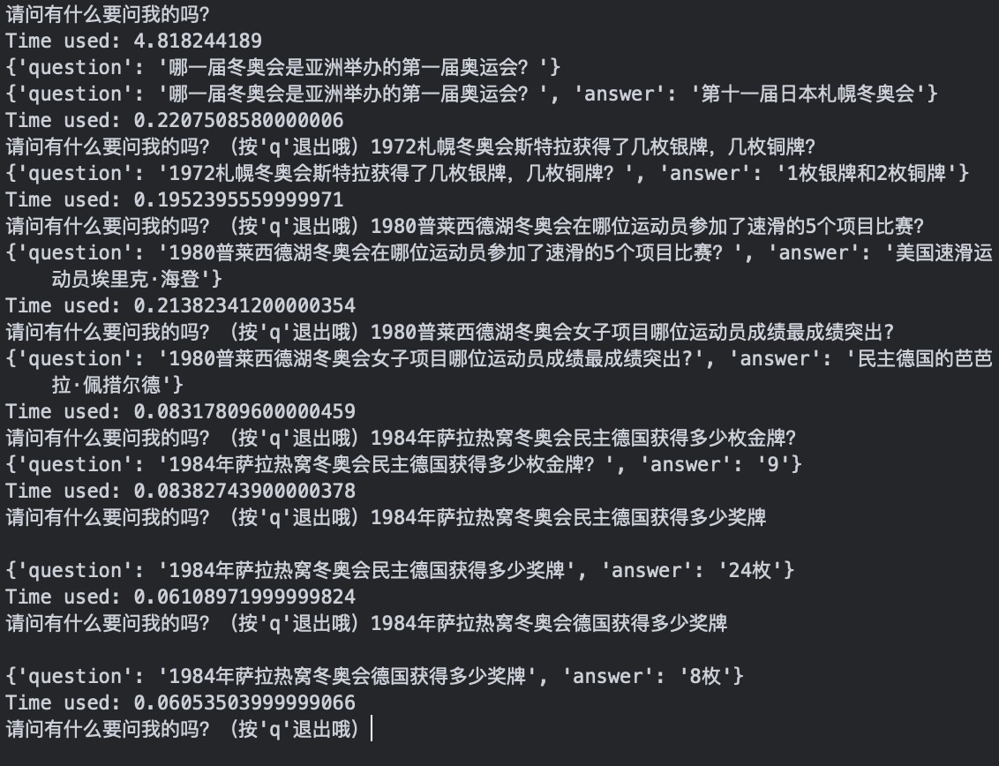

# 冬奥会领域问答机器⼈项⽬报告

## 1  项目简介

### 1.1  问题背景

2015 年 7 月 31 日，北京申办 2020 年奥运会成功，将与张家口市联合举办 2020 年冬奥会。因此，构造一个能够自动回答冬奥会相关领域问题的问答系统，以满足人们日益增长的知识需求，是很有必要的。

### 1.2  问题概述

构建⼀个有关冬奥会的问答系统。其功能为：输⼊⼀个与冬奥会相关的问题时，系统能给出相应的正确答案。

> **举例**：
>
> - 问：哪⼀届冬奥会是亚洲举办的第⼀届奥运会？
>
> - 答：第⼗⼀届⽇本札幌冬奥会/第⼗⼀届/11/⽇本札幌冬奥会。

### 1.3  已有数据

1. 14701 条标注数据，即正确匹配的问答对：
   - 每个问答对包括：问题，答案，#1问句类型，  #1领域类型，#1语义类型，#2问句类型，#2领域类型，#2语义类型；
2. WinterOlympics 知识图谱。

### 1.4  项目要求

1. 输⼊输出均为 json 格式，例如 `{“answer”:”...”,”question”:”...”}` ;
2. 除去加载初始模型的时间，单次响应时间在 500 ms 以内。

## 2  实施方案

### 2.1  设计思路

1. 设计一个完整的对话系统，首先需要对数据进行预处理：
   - 删除无用文字和无效问答对；
   - 去标点，分词；
2. 对数据进行向量化建模，以便检索：
   - 这里我们可选的方法有词频向量化、词向量方法、句向量方法等；
   - 选用 TF-IDF 或 Word2vec 进行向量化，然后将向量化的测试问题与每一个训练集问句进行比对，输出相似度最高的问句的答案。

> 由于词频向量化仅仅将词汇考虑成一个数字，不带有感情因素，最终不采用。

### 2.2  模型 1 : TF-IDF

TF-IDF 是一种统计方法，用以评估一字词对于一个文件集或一个语料库中的其中一份文件的重要程度。其中，TF 是词频，IDF 为逆文本频率指数。

TF-IDF 的主要思想是：如果某个词或短语在一篇文章中出现的频率 TF 高，并且在其他文章中很少出现，则认为此词或者短语具有很好的类别区分能力，适合用来分类。

### 2.3  模型 2 : Word2Vec

Word2vec 模型是一个双层的神经网络，利用连续词袋模型（CBOW, Continuous Bag Of Words）来建立神经词嵌入 (Word Embedding) 。简言之，它将词语转化为词向量。

词向量具有良好的语义特性，是表示词语特征的常用方式。词向量每一维的值代表一个具有一定的语义和语法上解释的特征。

## 3  解决思路 1: TF-IDF

### 3.1  步骤简介

使用 tf-idf ⽅法，建立关于文本的句向量模型，并将⽤户 query 关键词的 tf-idf 之和作为相似度的度量。

具体步骤如下：

1. 数据清洗，返回训练问题集
2. 分词，建⽴词表
3. 对训练问题集建⽴ tf-idf 矩阵
4. 计算⽤户 query 的关键词，并找到关键词对应的 id
5. 根据 tf-idf 矩阵，找到得分最⾼的回答
6. 以 json 格式编码该回答，返回

### 3.2  具体实现

#### 3.2.1  准备问答对

合并两个标注数据集的问答对，对所有的问题分词并转换成词向量。

```python
def prepare_data():
    # 合并两个标注数据集的问答对
    data1 = pd.read_excel('data/标注数据1.xlsx', usecols=[0, 1])
    data1.columns = ['question', 'answer']
    data2 = pd.read_excel('data/标注数据2.xlsx', usecols=[0, 1])
    data2.columns = ['question', 'answer']
    data = pd.concat([data1, data2], sort=True)
    print(data.shape)
    # 分词
    questions = list(data.loc[:, 'question'])
    corpus = []
    for q in questions:
        corpus.append(' '.join(jieba.lcut(str(q))))
    # 分词后的问题转换成词向量
    vec = TfidfVectorizer(token_pattern=r"(?u)\b\w+\b", stop_words=[' 冬奥会', '冬季', '奥林匹克', '运动会'])
    tfidf = vec.fit_transform(corpus).toarray()
    print(tfidf.shape)
    words = vec.get_feature_names()
    with open('data/word.txt', 'w', encoding='utf-8') as f:
        for i in range(len(words)):
            f.write(words[i]+'\n')
    tfidf = list(tfidf)	                        # 问答库tf-idf矩阵
    words = list(words)                     	# 特征词列表
    data = data[['question', 'answer']].values	# 问答对集合
    return tfidf, words, data
```

其中调⽤了 sklearn 库中的 `TfidfVectorizer `函数将分词后的问题向量化。

设置停⽤词  为“冬奥会”、“冬季”、“奥林匹克”、“运动会”，因为这⼏个词出现频率较⾼但对⽂本特征的意义不⼤。但是设计的停⽤词还较少，虽有⼀定效果但是作⽤不太明显。

小结：这⼀阶段准备好了问答库的 tf-idf 矩阵、特征词列表及问答对集合。

#### 3.2.2  处理⽤户 query

受测试时间的限制，我们放弃了使⽤余弦相似度计算⽤户 query 和问题库句⼦之间的相似度，⽽是对⽤户 query 分词后找到其在特征词列表中的索引，以便在后续步骤中计算 tf-idf 的和作为相似度的度量。

```python
# 找到⽤户query中关键词对应的id，以便之后tf-idf数值的⽐较
def process_query(qr, word_ls):
	split_text = jieba.lcut(qr) 4	ids = []
	for word in split_text:
		if word in word_ls:
			ids.append(word_ls.index(word))
	return ids
```

#### 3.2.3  返回最好的回答

根据第 2 步中得到的特征词索引，可计算⽤户 query 相对于问题库每个句⼦的 tf-idf 之 和，分值越⼤，反映了两个句⼦之间相似度越⼤，选取分值最⼤的问题对应的回答作为输出 给⽤户的回答。

```python
# 基于 tf-idf 的数值返回最好的结果
def get_top_ans(ids, tfidf, qr, qa_set):
	year_user = re.findall(r'[1][9]\d{2}|[2][0]\d{2}', str(qr))
    index = 0
    max_row_index = 0
    max_val = 0
    for row in tfidf:
    	year_lib = re.findall(r'[1][9]\d{2}|[2][0]\d{2}',
    						str(qa_set[index][0]))
        # 匹配⽤户query和问题库的年份
		if len(year_user) == 0 or len(year_lib) == 0
            or len(list(set(year_user) & set(year_lib))) != 0:
            temp = 0
            for i in ids:
                temp += row[i]
            if temp > max_val:
                max_val = temp
                max_row_index = index
		index += 1
	return max_row_index	# 返回最好匹配问答对的index
```

#### 3.2.4  以 json 格式输出

```python
def json_encode(question, answer):
    output = {'question': question, 'answer': answer}
    file = open('json\\output.json', 'w', encoding='utf-8')
    json.dump(output, file)
    print(output)
```

#### 3.2.5  手动输入测试

```python
# ⼿动输⼊的测试
def answer_qr(tfidf, word_ls, qa_set):
    while True:
        qr = input("请问有什么要问我的吗？（按'q'退出哦）")
        start = time.perf_counter()
        if qr == 'q':
            print('拜拜～')
            break
        else:
            ids_qr = process_query(qr, word_ls)
            index = get_top_ans(ids_qr, tfidf, qr, qa_set)
            ans = qa_set[index][1]
            json_encode(str(qr), str(ans))	# 以json格式输出
        print('Time used:', time.perf_counter() - start)
    return
```


## 4  解决思路 2: word2vec

### 4.1  步骤简介

使用 Genism 中集成的 word2vec 包，运用连续词袋模型 CBOW (Continuous Bag-of-Words Model) 将词转化为词向量，结合问句和测试句的词汇由词向量比较测试问句和用例问句的相似度，返回相似度最高的问句对应的答句。

具体步骤如下：

1. 数据清洗，返回训练问句集；
2. 分词，生成分词后的训练问句集；
3. 对训练问句集调用 Word2Vec 完成词嵌入，生成词向量模型；
4. 计算得到训练集与测试集相似度最高的问题下标，以 json 形式返回对应的答案。

### 4.2  具体实现

#### 4.2.1  数据预处理

先只保留问句中的汉字、字母和数字，并调用 `jieba_cut()` 将问句进行分词。

因为问答系统中有很多人名，在 jieba 词典中添加了用户词典 `usr_dict` 。

```python
# 分词
def cutword(seg):
    dict = []
    words = jieba.cut(seg)
    for word in words:
        if word not in stop_list:
            dict.append(word)
    string = ' '.join(dict)
    acquire = '[\s\u4e00-\u9fa5A-Za-z0-9]+' # 只保留空格/中文/字母/数字
    result = re.findall(acquire, string)
    return ' '.join(result)
```

#### 4.2.2  生成词向量

调用 Word2Vec 进行词嵌入，并进行必要的参数调整：

- `size=200 ` 代表生成的词向量空间是 200 维的；
- `window=5 ` 代表该词与上下文 5 个词有关系；
- 由于训练集问句较短， `jieba_cut()` 的表现较好 (即：切错词较少) ，于是将 `min_count `设为 1 ，表示不丢弃训练数据中的词。

```python
# 使用 gensim 中集成的 word2vec 包，训练模型
def train(dir_txt, dir_model_out):
    # 将原始问句集读入 buf[]
    buf=[]
    with open(dir_txt, 'r', encoding='utf-8') as fr:
        for line in fr:
            buf.append(list(line.strip('\n').split(' ')))

    print('[Model] Start!')
    # 调用 word2vec.Word2Vec 完成 word-embedding
    model = word2vec.Word2Vec(sentences=buf, # 待处理的句子
                              size=200,      # 向量空间的维数
                              window=5,      # 上下文窗口大小(词数)
                              min_count=1)   # 最小统计词频(小于它则忽略)
    vocab = list(model.wv.vocab.keys()) # 将 model 中出现过的所有词存入 vocab
    model.save(dir_model_out) # 保存 model 文件
    print('[Model] Saved!')
```

#### 4.2.3  对比相似度返回结果

调用 `model.wv.n_similarity() `计算测试用句与问句的相似度，并返回相似度最高的问句下标，输出结果为对应下标的答句。

```python
# 寻找与输入的问题(单个)相似度最高的训练集问题
#   输入： 句子组成的 list, 训练集问题组成的 list(已分词)
#   输出： 与输入的问题(单个)相似度最高的训练集问题的下标
def calc_vlist(vlist, train_q_list):
    max_score = 0
    index = 0
    i = 0
    for qlist in train_q_list:
        score = model.wv.n_similarity(qlist, vlist)
        if score > max_score:
            max_score = score
            index = i
        i = i + 1
    return index
```

结果以 json 形式输出。

```python
# 编码 json 输出，并保存到 json\\output.json
#   输入： 测试问题，找到的答案
#   输出： 无(打印并在文件中写入结果)
def json_encode(question, answer):
    output = {'question': question, 'answer': answer}
    file = open('json\\output.json', 'w', encoding='utf-8')
    json.dump(output, file)
    print(output)
```

## 5  实验结果

对于问答系统的评测，我们采⽤⼈⼯评测的⽅法，即对问答系统随机提出⼀些问题，并⼈⼯验证其答案的正确性。

### 5.1  评估 TF-IDF 方法



我们发现：

1. 前五个问题均为标注数据中的原句。当提出的问题为原句时，基本返回的结果就是标注数据中的该问题的答案，结果正确。这说明整体实现成功，系统能够完成基于检索的问答功能；
2. 倒数第⼆个问题，标注数据中有⺠主德国获得⾦银铜牌的数⽬，询问的事⺠主德国⼀共获得了多少枚奖牌，结果正确。这说明系统能够进⾏简单的推理；
3. 最后一个问题，询问德国获得的奖牌情况，结果错误。这说明系统暂时无法在此语境下将“德国”理解成“民主德国”，系统还不支持较复杂的语义推断。

### 5.2  评估 word2vec 方法

将输出重定向到文件，得到测试集问题的结果：

```
维科-哈库利宁参加了1960斯阔谷冬奥会什么项目
 男女双人滑
1960斯阔谷冬奥会芬兰的越野滑雪运动员维科-哈库利宁总共获得了多少枚金牌？
 七枚奥运奖牌
哪一届冬奥会是亚洲举办的第一届奥运会？
 第十一届日本札幌冬奥会
1984年萨拉热窝冬奥会的参赛运动员有多少人？
 1272人
1984年萨拉热窝冬奥会的参赛男运动员有多少人？
 998人
1984年萨拉热窝冬奥会的参赛女运动员有多少人？
 274人
1984年萨拉热窝冬奥会民主德国获得多少枚金，银，铜牌？
 1枚
1984年萨拉热窝冬奥会民主德国获得多少枚银牌？
 9
1984年萨拉热窝冬奥会民主德国获得多少枚铜牌？
 6
冬奥会一般几年举办一次
 有意义
```

可以看到，较大比例的问题得到了正确的答案，有一部分有意义的答案是错误的，这主要是因为一些近义词的向量处理不够精细；另外一部分问题的答案完全牛头不对马嘴，如果我们的训练中加入预分类环节，这一点或许能得到有效的改善，但可能会牺牲性能。

遗憾的是，不论如何优化参数，哪怕损失正确率，都无法做到将响应时间控制在 600 ms 以下，这可能是因为调取的库本身比较庞大或依赖较大，也有可能是轻薄本性能所限。

## 6  实验反思

1. [TF-IDF] 向量化部分 `TfidfVctorizer()` 可调参，但效果很难评估；
2. [TF-IDF] 检索过程中只处理了年份，地点如“北京”“札幌”“盐城湖”等还没有办法处理，导致用户 query 不全时不能检索到最佳答案；
3. [word2vec] 没有找到能有效优化 word2vec 模型响应时间的方法；
4. 如果用户词典更丰富，则训练效果可能更好。

## 7  进一步优化

如果时间充足，应该运用预分类优化的方法，利用提供数据的标签进一步提高问答结果准确率。根据机器学习的知识，可能的做法有：

- **SVM**: 基于选定的支持向量，构造高维超平面来实现数据集的划分，进而预测文本标签
- **NB**: 基于变量独立性假设，通过最大似然估计确定标签
- **KNN**: 根据 $K$ 值确定的范围，按多数表决的方式确定数值的标签
- **LR**: 借助 Sigmoid 函数对数据点进行拟合，并以此预测文本标签的概率
- **DT**: 通过在特征空间插入超矩形，实现数据集的划分
- **RF**: 聚合决策树，通过多数表决的方式得到标签预测
- ……

## 附  任务分工

- [@chuan-325](https://github.com/chuan-325)：word2vec  算法建模、调试、报告

- [@XinyiYuan](https://github.com/XinyiYuan)：tfidf 算法建模、调试、报告

- [@FuWenyi](https://github.com/FuWenyi)：数据预处理、串联报告、PPT、presentation


